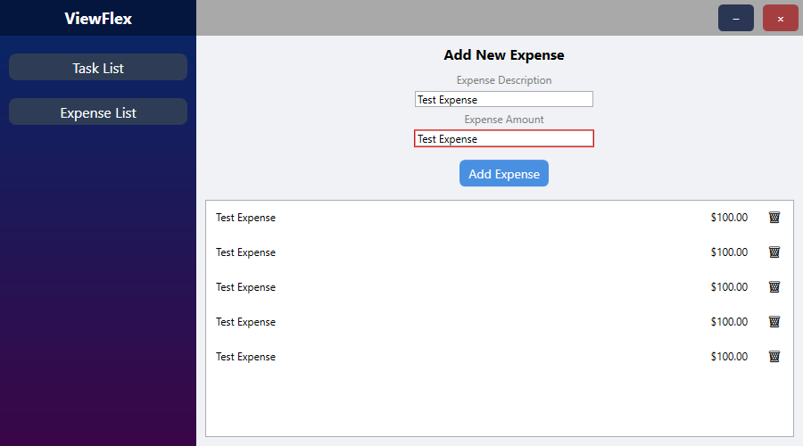

# ViewFlex

ViewFlex is a sample application built with WPF technology that demonstrates the implementation of the MVVM (Model-View-ViewModel) design pattern.

## Screenshots

## Technology Stack

C# / .NET / WPF / Prism

## Authors

[@o-szymanski](https://github.com/o-szymanski)

## License

[MIT](https://choosealicense.com/licenses/mit/)
